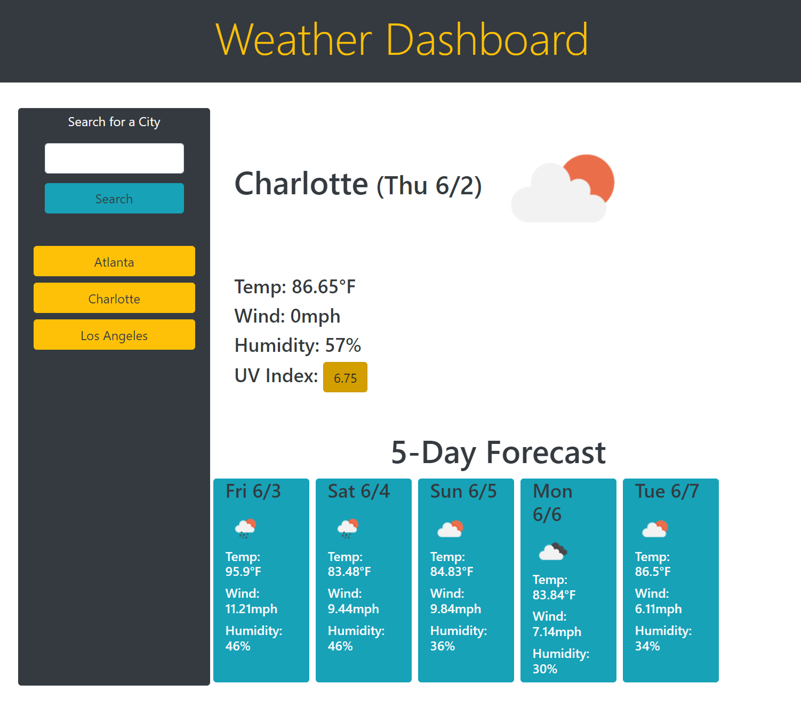

# Weather Darhboard (06-Server-Side APIs Challenge)

[Live Site on Github.io](https://cokamuro.github.io/weather-dashboard/)

## Table of Contents
- [Description](#description)
- [Visuals](#visuals)
- [Usage](#usage)

## Description
This is the solution HTML, CSS, and JavaScript for the 02-Challenge assignment in the 06-Server-Side APIs Module.

The purpose of the assignment was to create a weather dashboard that uses the OpenWeatherMap API to retrieve geolocation, current weather, and forecasted weather.

The dashboard populates a few reference cities, but it also adds your searched cities as "quick reference" buttons on the search pane.  The returned data is displayed in English/Imperial units (degrees F, mph).  The images corresponding to the weather conditions are displayed in each section, and the alt text is set to the text description (for accessiblity).  Bootstrap is used for the layout, and Moment is used for the date formatting.  

## Visuals
### The site in operation

## Usage
This project is complete and should have no future revisions    
